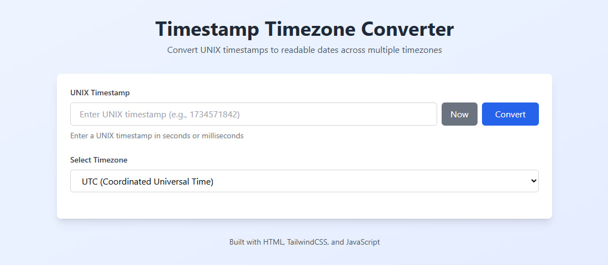
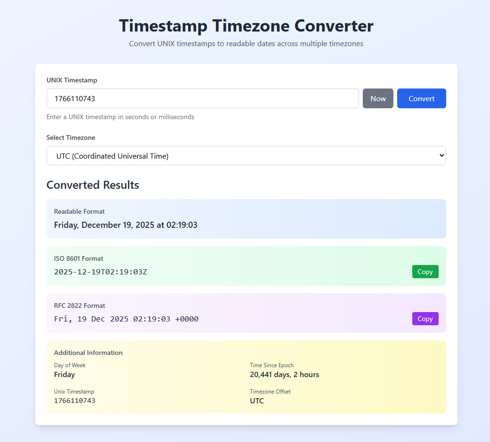

# Timestamp Timezone Converter

Convert UNIX timestamps to readable dates across multiple timezones with support for ISO 8601 and RFC 2822 formats.

## Features

- 🕐 Convert UNIX timestamps (seconds or milliseconds) to readable dates
- 🌍 Support for 16 different timezones worldwide
- 📋 Output formats:
  - Human-readable format
  - ISO 8601 format
  - RFC 2822 format
- 📊 Additional information display:
  - Day of week
  - Time since epoch
  - Timezone offset
- 📋 Copy to clipboard functionality
- ✨ Clean, modern UI with TailwindCSS
- ⚡ Real-time conversion with timezone switching

## Usage

Simply open `index.html` in your web browser. No installation or build process required!

1. Enter a UNIX timestamp (or click "Now" for current time)
2. Select your desired timezone
3. Click "Convert" to see results in multiple formats
4. Use the "Copy" buttons to copy specific formats to clipboard

## Supported Timezones

- UTC (Coordinated Universal Time)
- America/New_York (EST/EDT)
- America/Chicago (CST/CDT)
- America/Denver (MST/MDT)
- America/Los_Angeles (PST/PDT)
- Europe/London (GMT/BST)
- Europe/Paris (CET/CEST)
- Europe/Berlin (CET/CEST)
- Europe/Moscow (MSK)
- Asia/Dubai (GST)
- Asia/Kolkata (IST)
- Asia/Shanghai (CST)
- Asia/Tokyo (JST)
- Asia/Singapore (SGT)
- Australia/Sydney (AEDT/AEST)
- Pacific/Auckland (NZDT/NZST)

## Technologies

- HTML5
- TailwindCSS (via CDN)
- Vanilla JavaScript (ES6+)

## License

See LICENSE file for details.
